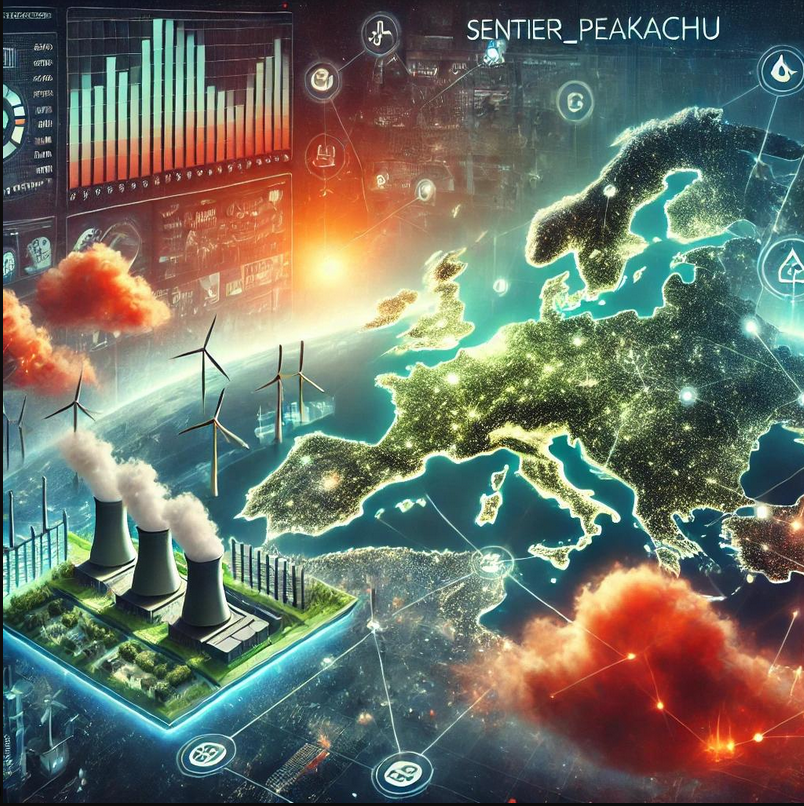

# sentier_peakachu

```{button-link} https://docs.brightway.dev
:color: info
:expand:
{octicon}`light-bulb;1em` sentier_peakachu is a specialized package of the Brightway Software Framework
```
## Overview


The Sentier Peakachu package is designed to calculate the carbon footprint of electricity production, focusing on 1 kWh of electricity produced from a specific energy mix or technology at a particular region and time. This functionality enables users to quantify the emissions impact of electricity generation under various scenarios, providing insights into the environmental performance of different power generation methods.
The package draws from two key data sources:
* **ENTSO-E**: Plant-specific carbon emissions data, offering granular information about emissions produced by individual power plants in Europe.
* **Climate Trace**: A comprehensive dataset on electricity generation mixes, covering a wide range of technologies such as coal, natural gas, solar, wind, nuclear, biomass, and more. This dataset includes regional and temporal variations in electricity production, allowing for highly specific analyses.

## Purpose and Features

The primary goal of the sentier_peakachu package is to merge detailed emissions data with real-world energy mix information to create region-time-specific datasets. These datasets reflect the carbon emissions associated with either specific electricity production technologies (such as wind or coal) or a combination of technologies within a given mix at a particular location and time.
By enabling users to model these scenarios, the package supports:

Detailed Carbon Footprint Analysis: Accurate calculation of the CO₂ emissions per kWh of electricity, considering the specific mix of energy sources in a given area.
Technology-Specific Emission Insights: The ability to isolate emissions for individual power generation technologies and compare their environmental impact.
Regional and Temporal Flexibility: The package accounts for local conditions and the availability of renewable and non-renewable technologies, making the results relevant for policy-makers, researchers, and companies aiming to reduce emissions.
Practical Applications

This tool can be applied in various fields, such as:

-Sustainability Reporting: Helping organizations track and report their carbon emissions from energy use, based on real-world data.

-Energy Policy and Planning: Supporting government and industry decisions by providing insights into the carbon footprint of different energy sources at specific times and locations.

-Life Cycle Assessment (LCA): Integrating seamlessly with broader LCA frameworks to evaluate the overall environmental impact of energy generation as part of a product or service lifecycle.
Future Enhancements

Sentier Peakachu is part of the Brightway Software Framework, a widely-used platform for Life Cycle Assessment (LCA). Planned future updates will include extended support for global electricity datasets, improved integration with existing LCA tools, and more sophisticated algorithms for analyzing the environmental performance of electricity production.


## hierarchy of ontology
```{mermaid}
graph LR
A(Electrical energy) --> B(Fossil fuel-based electrical energy)
A(Electrical energy) --> C(Renewable electrical energy)
A(Electrical energy) --> D(Nuclear-based electrical energy)
A(Electrical energy) --> E(Waste-based electrical energy)
A(Electrical energy) --> F(Other electrical energy sources)
```

```{mermaid}
graph LR
A(Fossil fuel-based electrical energy) --> B(Fossil oil-based electrical energy)
B(Fossil oil-based electrical energy) --> F(Electrical energy from crude oil)
B(Fossil oil-based electrical energy) --> G(Electrical energy from oil shale)
A(Fossil fuel-based electrical energy) --> C(Natural gas-based electrical energy)
C(Natural gas-based electrical energy) --> H(Electrical energy from natural gas)
C(Natural gas-based electrical energy) --> I(Electrical energy from coal seam gas)
A(Fossil fuel-based electrical energy) --> D(Coal-based electrical energy)
D(Coal-based electrical energy) --> J(Electrical energy from hard coal)
D(Coal-based electrical energy) --> K(Electrical energy from brown coal/lignite)
A(Fossil fuel-based electrical energy) --> E(Electrical energy from peat)
```

```{mermaid}
graph LR
A(Renewable electrical energy) --> B(Electricity from wind energy)
B(Electricity from wind energy) --> E(Electricity from offshore wind energy)
B(Electricity from wind energy) --> F(Electricity from onshore wind energy)
A(Renewable electrical energy) --> C(Electricity from hydropower)
C(Electricity from hydropower) --> G(Electrical energy from hydro water reservoirs)
C(Electricity from hydropower) --> H(Electrical energy from pumped storage hydro)
C(Electricity from hydropower) --> I(Electrical energy from run-of-river and poundage hydro)
C(Electricity from hydropower) --> J(Electrical energy from marine sources)
A(Renewable electrical energy) --> D(Solar-based electrical energy)
```


```{toctree}
---
hidden:
maxdepth: 1
---
self
Structure <content/structure>
Usage <content/usage>
API Reference<content/api/index>
Code of Conduct<content/codeofconduct>
Contributing<content/contributing>
License<content/license>
Changelog<content/changelog>
```
